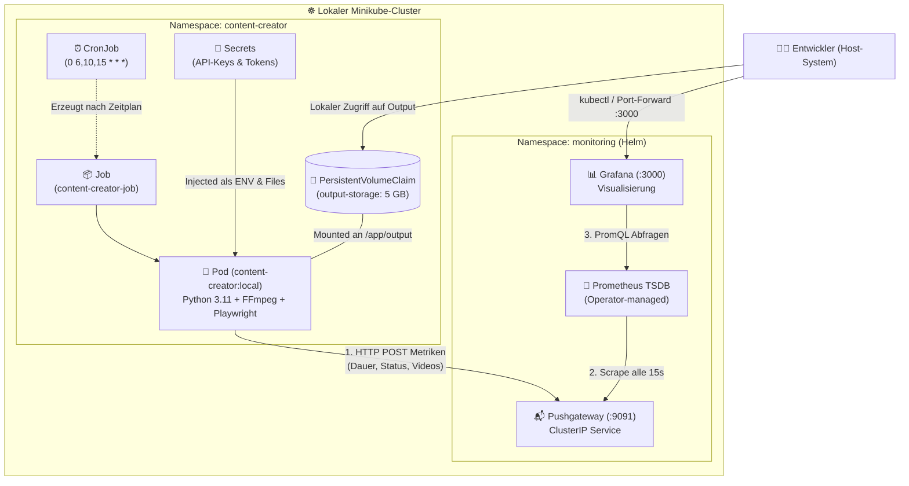
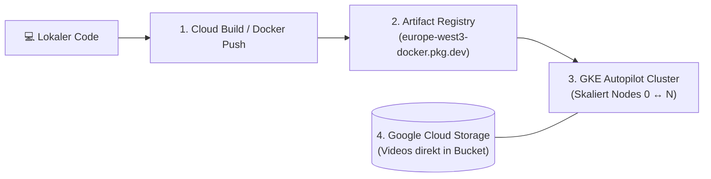

# ☸️ Kubernetes & Helm Architekturhandbuch: Theodor Family Content Creator

Dieses Dokument bietet eine vollständige, schrittweise Dokumentation der Kubernetes-Implementierung mit **Minikube** und dem **kube-prometheus-stack** (Helm), erklärt die strategischen Vorteile gegenüber reinem Docker/GitHub Actions, beschreibt den Migrationspfad in die Google Cloud (GKE) und liefert eine genaue Fehleranalyse zum Monitoring-Datenfluss.

---

## 🗺️ 1. Gesamtarchitektur im Cluster



---

## 👣 2. Step-by-Step: Was wurde genau gemacht?

### Phase 1: Cluster-Vorbereitung & Namespace-Isolation
* **Bestehender Cluster:** Minikube war bereits auf dem System installiert (`v1.39.0` mit Docker-Treiber).
* **Namespace `content-creator` ([k8s/namespace.yaml](file:///c:/Projects/theodor-family-content-creator/k8s/namespace.yaml)):**
  In Kubernetes ist ein Namespace ein virtueller, isolierter Bereich. Wir haben `content-creator` für die Video-Pipeline und `monitoring` für den Prometheus-Stack angelegt. Das verhindert Namenskonflikte und ermöglicht getrennte Berechtigungen und Ressourcen-Quotas.

### Phase 2: Containerisierung mit Docker ([Dockerfile](file:///c:/Projects/theodor-family-content-creator/Dockerfile))
Bisher lief die Pipeline direkt auf dem Host oder in einem virtuellen GitHub-Runner. Für Kubernetes wurde ein maßgeschneidertes Multi-Dependency-Image gebaut:
1. **Basis:** `python:3.11-slim` für minimale Image-Größe und hohe Sicherheit.
2. **Systempakete:** Installation von `ffmpeg` (zur Audio-/Video-Synthese) und `curl`.
3. **Python-Pakete:** Installation aller Abhängigkeiten aus [requirements.txt](file:///c:/Projects/theodor-family-content-creator/requirements.txt).
4. **Playwright Chromium:** `playwright install --with-deps chromium` lädt den Headless-Browser inklusive aller Linux-Grafikbibliotheken (`libgbm`, `libnss`, `libasound`) in den Container.
5. **Image-Transfer ohne Registry:** Mit `minikube image load content-creator:local` wurde das 1.8 GB große Image direkt in die interne Docker-Runtime von Minikube transferiert. Kein Upload zu Docker Hub oder Google Cloud nötig.

### Phase 3: Persistenz (PVC) & Secret-Management
* **Warum Persistenz nötig ist:** Container sind standardmäßig flüchtig (*ephemeral*). Wenn ein Job endet, wird der Container zerstört und alle neu erstellten Dateien im Container gehen verloren!
* **PersistentVolumeClaim ([k8s/pvc.yaml](file:///c:/Projects/theodor-family-content-creator/k8s/pvc.yaml)):**
  Ein 5-GB-Speicherblock (`content-creator-output-pvc`) wird an das Verzeichnis `/app/output` im Pod gebunden. Dadurch bleiben die generierten MP4-Videos, MP3s und die Zähler-Dateien (`historie_shorts.json`, `historie_long.json`) dauerhaft erhalten.
* **Secrets-Automatisierung ([k8s/setup-secrets.ps1](file:///c:/Projects/theodor-family-content-creator/k8s/setup-secrets.ps1)):**
  API-Keys dürfen niemals im Docker-Image oder in Git liegen. Das Skript liest die lokale `.env` ein und erzeugt das Secret `content-creator-secrets`. Google-Token-Dateien (`credentials.json`, `token.json`, `drive_token.json`) werden als `content-creator-google-tokens` abgelegt und als ReadOnly-Dateien in den Container gemountet.

### Phase 4: Batch-Orchestrierung mit Job & CronJob
* **Warum kein normales `Deployment`?**
  * Ein Kubernetes `Deployment` ist für Webserver (wie Nginx oder Grafana) gedacht, die 24/7 durchlaufen.
  * Wenn ein Skript nach 3 Minuten seine Arbeit erfolgreich beendet (`exit 0`), interpretiert ein Deployment das als Fehler/Absturz und startet den Pod endlos neu (`CrashLoopBackOff`).
* **Kubernetes `Job` ([k8s/job-pipeline.yaml](file:///c:/Projects/theodor-family-content-creator/k8s/job-pipeline.yaml)):**
  Führt die Pipeline genau einmal aus. Sobald der Exit-Code 0 ist, wird der Pod auf den finalen Zustand `Completed` gesetzt und beendet.
* **Kubernetes `CronJob` ([k8s/cronjob-pipeline.yaml](file:///c:/Projects/theodor-family-content-creator/k8s/cronjob-pipeline.yaml)):**
  * Zeitplan: `0 6,10,15 * * *` (jeden Tag um 08:00, 12:00 und 17:00 Uhr deutscher Zeit).
  * `concurrencyPolicy: Forbid`: Verhindert, dass ein zweiter Job startet, wenn der vorherige noch rendert. Das schützt die Historien-Dateien vor Dateikonflikten.

### Phase 5: Enterprise-Monitoring via Helm (`kube-prometheus-stack`)
* **Helm v4.3.0** wurde auf dem Windows-System installiert.
* **Kube-Prometheus-Stack:** Über ein einziges Helm-Chart wurden der **Prometheus Operator**, **Prometheus**, **Grafana**, **Alertmanager**, **Node-Exporter** und **Kube-State-Metrics** im Namespace `monitoring` installiert.
* **Pushgateway ([k8s/pushgateway.yaml](file:///c:/Projects/theodor-family-content-creator/k8s/pushgateway.yaml)):**
  Da kurzlebige Jobs nicht von Prometheus per Pull abgefragt werden können, sendet der Job seine Metriken per HTTP POST an das Pushgateway.

---

## 💡 3. Welche konkreten Vorteile bringt uns Kubernetes?

| Aspekt | Vorher (GitHub Actions / Docker Compose) | Jetzt (Kubernetes / Minikube) |
| :--- | :--- | :--- |
| **Portabilität** | Gebunden an GitHub Runners (Cloud) oder lokale Docker-Skripte. | **100 % Cloud-Native Standard:** Exakt dieselben YAML-Manifeste laufen lokal, auf GKE, AWS EKS oder Bare-Metal. |
| **Ressourcenkontrolle** | Keine Limits; Rendering kann das Host-System verlangsamen. | **Dedizierte Limits:** Pods erhalten feste CPU/RAM-Grenzen (`requests: 500m/512Mi`, `limits: 2 CPU/2Gi`). |
| **Persistenz** | Artefakte mussten in GitHub hochgeladen oder per Git committet werden. | **Echte Speicher-Volumes (PVC):** Daten bleiben auf Block-Speicherebene erhalten. |
| **Sicherheit** | Secrets liegen in CI/CD-Systemen oder Klartext-`.env`. | **RBAC & K8s Secrets:** Verschlüsselte Injektion zur Laufzeit, strikt getrennt vom Quellcode. |
| **Wartbarkeit** | Shell-Skripte mit impliziten Abhängigkeiten. | **Deklarativer Zustand (GitOps):** Die gesamte Infrastruktur ist versionierter Code (`Infrastructure as Code`). |

---

## ☁️ 4. Cloud-Roadmap: Wie entwickeln wir auf Google Cloud (GKE) weiter?

Wenn du von der lokalen Minikube-Umgebung auf die **Google Kubernetes Engine (GKE)** umsteigen möchtest, sind nur 4 logische Schritte notwendig:



### Schritt 1: Docker Image in die Google Artifact Registry (GAR) pushen
Statt `minikube image load` wird das Image in deine private Container Registry geladen:
```bash
# Repository in Frankfurt erstellen:
gcloud artifacts repositories create content-creator --repository-format=docker --location=europe-west3

# Image taggen & pushen:
docker tag content-creator:local europe-west3-docker.pkg.dev/<DEIN_GCP_PROJECT_ID>/content-creator/app:v1
docker push europe-west3-docker.pkg.dev/<DEIN_GCP_PROJECT_ID>/content-creator/app:v1
```

### Schritt 2: GKE Autopilot Cluster erstellen
Mit **GKE Autopilot** verwaltet Google die Serverknoten vollständig selbst. Du zahlst **nur für die Sekunden, in denen dein Job tatsächlich läuft**:
```bash
gcloud container clusters create-auto theodor-k8s-cluster \
  --region europe-west3 \
  --project <DEIN_GCP_PROJECT_ID>
```

### Schritt 3: Workload Identity einrichten (Keyless Security)
Keine `credentials.json` mehr nötig! Dein Kubernetes Service Account (`content-creator-sa`) authentifiziert sich über IAM direkt bei Google Gemini, Cloud Storage und Cloud Monitoring:
```bash
gcloud iam service-accounts add-iam-policy-binding \
  content-creator-sa@<DEIN_GCP_PROJECT_ID>.iam.gserviceaccount.com \
  --role roles/iam.workloadIdentityUser \
  --member "serviceAccount:<DEIN_GCP_PROJECT_ID>.svc.id.goog[content-creator/content-creator-sa]"
```

### Schritt 4: GCS-Bucket für Output nutzen (Cloud Storage FUSE)
In GKE kannst du einen Cloud Storage Bucket direkt als Verzeichnis `/app/output` in den Pod einhängen. Jedes gerenderte Video landet sofort sicher in Google Cloud Storage!

---

## 🔍 5. Troubleshooting: Warum Metriken bei dynamischen Cloud-IPs verloren gehen können

### Die Ursachenkette:
1. **Der Lauf um 21:46 Uhr lief in GitHub Actions (Cloud):**
   Um 21:52 Uhr deutscher Zeit (19:52 UTC) hat der GitHub Actions Runner die Pipeline ausgeführt und das Video generiert.
2. **Die IP-Änderung bei VM-Neustarts:**
   Wenn eine Cloud-VM ohne reservierte statische IP neu gestartet wird, weist Google Cloud eine neue öffentliche IP zu.
3. **Das veraltete GitHub Secret:**
   In den **GitHub Repository Secrets** war `PUSHGATEWAY_URL` noch mit der vorherigen IP konfiguriert.
4. **Verbindungsabbruch im Runner:**
   Am Ende des Laufs versuchte `send_monitoring_metrics.py` die Metriken an die alte IP zu senden. Da diese nicht mehr antwortete, lief der HTTP-Request in einen Timeout. Der Job selbst war erfolgreich, aber die Metrik kam in Prometheus nie an.
5. **Minikube vs. Cloud:**
   Das neu installierte Grafana in Minikube läuft lokal auf deinem Rechner (`localhost:3000`) und empfängt naturgemäß keine externen GitHub-Cloud-Events.

### Dauerhafte Lösung für GitHub Actions:
Aktualisiere in deinen GitHub-Repository-Einstellungen:
* **Pfad:** `Settings` -> `Secrets and variables` -> `Actions` -> `PUSHGATEWAY_URL`
* **Neuer Wert:** `http://admin:<DEIN_PUSHGATEWAY_PASSWORT>@<MONITORING_VM_IP>:9091`
*(Empfehlung: In der Google Cloud Console eine statische IP für die VM reservieren, damit sie sich bei Neustarts nie wieder ändert).*
