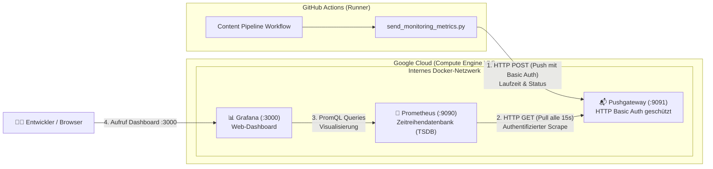

# 📊 Monitoring-Architektur: Prometheus, Grafana & Pushgateway auf Google Cloud

Dieses Dokument beschreibt die Architektur, Funktionsweise und Sicherheitskonfiguration des Monitoring-Stacks für die automatisierte Content-Pipeline.

---

## 🏗️ 1. Gesamtarchitektur & Datenfluss

GitHub Actions führt zeitgesteuerte Batch-Jobs aus (z. B. Video-Rendering, Uploads). Am Ende jedes Durchlaufs werden Metriken an eine dedizierte Monitoring-Instanz in Google Cloud übertragen:



---

## ❓ 2. Warum diese Komponenten-Kombination?

### Das Problem mit klassischem Prometheus in CI/CD
Prometheus arbeitet standardmäßig nach dem **Pull-Prinzip** (*Scraping*):
- Prometheus fragt Server zyklisch (z. B. alle 15 Sekunden) ab: *„Wie ist deine Auslastung?“*.
- **CI/CD-Workflows sind ephemere Batch-Jobs:** Ein GitHub-Runner startet in der Cloud, arbeitet 2–4 Minuten und wird anschließend sofort zerstört.
- Prometheus kann einen solchen temporären Runner weder im Internet auffinden noch anrufen.

### Die Lösung im Detail:
| Komponente | Rolle in der Architektur | Funktionsweise |
| :--- | :--- | :--- |
| **Pushgateway** | *Der Briefkasten / Puffer* | Nimmt Metriken von kurzlebigen Jobs per HTTP POST entgegen und hält sie im Arbeitsspeicher vor, bis Prometheus sie abholt. |
| **Prometheus** | *Die Zeitreihen-Datenbank* | Holt die Metriken alle 15 Sekunden vom Pushgateway ab (*Scrape*) und speichert sie historisiert in der TSDB (*Time Series Database*). |
| **Grafana** | *Die Visualisierungsebene* | Liest Metriken per PromQL aus Prometheus aus und stellt Dashboards mit Graphen, Erfolgsquoten und Alarmen dar. |

---

## ☁️ 3. Google Cloud Infrastruktur

Die Monitoring-Infrastruktur läuft auf einer Compute Engine VM in Frankfurt:

- **Instanz:** Compute Engine VM (`monitoring-vm`), Maschinentyp `e2-small`
- **Region / Zone:** `europe-west3-c` (Frankfurt)
- **Netzwerk / Firewall (`allow-monitoring`):**
  - Port `3000` (Grafana Web UI): Öffentlich für Browser-Zugriff erreichbar.
  - Port `9091` (Pushgateway API): Öffentlich erreichbar, aber zwingend durch **HTTP Basic Auth** geschützt.
  - Port `9090` (Prometheus API): **Nicht** öffentlich freigegeben. Prometheus kommuniziert ausschließlich geschützt im internen Docker-Netzwerk.

---

## 🔒 4. Sicherheitskonzept (Security by Design)

### A. Schutz vor unbefugtem Zugriff (Basic Auth)
Das Pushgateway verlangt zwingend Zugangsdaten. Jede Anfrage ohne gültige Authentifizierung wird mit `HTTP 401 Unauthorized` abgewiesen:
- **Konfigurationsdatei:** `monitoring/web-config.yml`
- **Passwortspeicherung:** Das Passwort wird niemals im Klartext, sondern als kryptografischer **Bcrypt-Hash** (`$2b$10$...`) hinterlegt.
- **Prometheus-Zugriff:** In `monitoring/prometheus.yml` sind die Zugangsdaten im `basic_auth`-Block hinterlegt, damit Prometheus das Gateway intern abrufen darf.

### B. Geheimhaltung im Git-Repository (Zero-Secrets-in-Git)
- Weder IP-Adressen noch Klartext-Passwörter oder Hashes befinden sich im Quellcode.
- Folgende Dateien sind in [.gitignore](file:///c:/Projects/theodor-family-content-creator/.gitignore) eingetragen und werden **niemals** nach GitHub übertragen:
  - `monitoring/web-config.yml` (enthält den echten Bcrypt-Hash)
  - `monitoring/prometheus.yml` (enthält das echte Scrape-Passwort)
  - `sa-key.json` (Service-Account-Schlüssel)
- Als sichere Vorlagen dienen die Dateien [monitoring/web-config.example.yml](file:///c:/Projects/theodor-family-content-creator/monitoring/web-config.example.yml) und [monitoring/prometheus.example.yml](file:///c:/Projects/theodor-family-content-creator/monitoring/prometheus.example.yml).

### C. GitHub Actions Secrets
GitHub Actions erhält die Verbindungsinformationen ausschließlich über verschlüsselte Repository Secrets:
- **Secret-Name:** `PUSHGATEWAY_URL`
- **Format:** `http://<USER>:<PASSWORT>@<EXTERNAL_IP>:9091`
- **Schutz:** GitHub maskiert dieses Secret in sämtlichen Action-Logs automatisch als `***`.

---

## 📈 5. Erfasste Metriken

Das Skript [.github/scripts/send_monitoring_metrics.py](file:///c:/Projects/theodor-family-content-creator/.github/scripts/send_monitoring_metrics.py) pusht am Ende der Pipeline standardisierte Metriken:

### 1. `github_workflow_duration_seconds` (Typ: Gauge)
Gibt die Gesamtlaufzeit der Pipeline in Sekunden an:
```text
github_workflow_duration_seconds{workflow="Content Pipeline",repo="user/repo",status="success"} 234.50
```

### 2. `github_workflow_status` (Typ: Gauge)
Gibt den Ausführungsstatus numerisch wieder (ideal für Verfügbarkeits- und Erfolgsquoten):
- `1` = Erfolgreich (`success`)
- `0` = Fehlerhaft oder abgebrochen (`failure`, `cancelled`)
```text
github_workflow_status{workflow="Content Pipeline",repo="user/repo",status="success"} 1
```

---

## 🖥️ 6. Grafana einrichten & nützliche PromQL-Abfragen

### Schritt 1: Data Source verbinden
1. Öffne Grafana im Browser unter `http://<EXTERNAL_IP>:3000`.
2. Melde dich an (Standard beim ersten Start: `admin` / `admin`).
3. Gehe zu **Connections** → **Data Sources** → **Add data source**.
4. Wähle **Prometheus** aus.
5. Trage als **Prometheus server URL** die interne Docker-Adresse ein:
   ```text
   http://prometheus:9090
   ```
6. Klicke ganz unten auf **Save & test** (es muss eine grüne Bestätigung erscheinen).

### Schritt 2: Panels im Dashboard erstellen

| Visualisierung | PromQL-Abfrage | Beschreibung |
| :--- | :--- | :--- |
| **Erfolgsquote (Stat / Gauge)** | `avg(github_workflow_status) * 100` | Zeigt die historische Erfolgsquote in Prozent (z. B. 98 %). |
| **Pipeline-Laufzeit (Time Series)** | `github_workflow_duration_seconds` | Verlaufsgraph der Pipeline-Dauer über Tage/Wochen. |
| **Durchschnittliche Dauer** | `avg(github_workflow_duration_seconds)` | Durchschnittliche Laufzeit in Sekunden. |
| **Aktueller Status (Badge)** | `github_workflow_status` | Zeigt `1` (Grün: OK) oder `0` (Rot: Fehler). |

---

## ⚙️ 7. Wartung & Nützliche Befehle

### Stack auf der VM verwalten
```bash
# Per SSH mit der VM verbinden
gcloud compute ssh monitoring-vm --zone=europe-west3-c

# Status der Container prüfen
sudo docker compose ps

# Live-Logs der Container ansehen
sudo docker compose logs -f

# Stack neu starten
sudo docker compose restart
```

### VM bei Nichtbenutzung stoppen (Kosten sparen)
```bash
# VM stoppen
gcloud compute instances stop monitoring-vm --zone=europe-west3-c

# VM wieder starten
gcloud compute instances start monitoring-vm --zone=europe-west3-c
```
